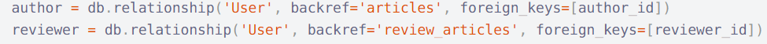

## 1、多外键处理多对多关系

```
SQLAchemy提示无法确定`Article.author`的父子表之间的关联，原因在于两张表之间存在多个外键。需要我们指定`foreign_keys`参数，提供一个包含关联了父表（即`User`表）外键的字段列表（`list`)
```

sqlalchemy.exc.AmbiguousForeignKeysError: Could not determine join condition between parent/child tables on relationship User.user_testcaseCreator - there are multiple foreign key paths linking the tables. Specify the 'foreign_keys' argument, providing a list of those columns which should be counted as containing a foreign key reference to the parent table.

```
INFO:__main__:Creating initial data
Traceback (most recent call last):
  File "/usr/local/lib/python3.7/site-packages/sqlalchemy/orm/relationships.py", line 2523, in _determine_joins
    consider_as_foreign_keys=consider_as_foreign_keys,
  File "<string>", line 2, in join_condition
  File "<string>", line 2, in _join_condition
  File "/usr/local/lib/python3.7/site-packages/sqlalchemy/util/deprecations.py", line 128, in warned
    return fn(*args, **kwargs)
  File "/usr/local/lib/python3.7/site-packages/sqlalchemy/sql/selectable.py", line 938, in _join_condition
    a, b, constraints, consider_as_foreign_keys
  File "/usr/local/lib/python3.7/site-packages/sqlalchemy/sql/selectable.py", line 1055, in _joincond_trim_constraints
    "join explicitly." % (a.description, b.description)
sqlalchemy.exc.AmbiguousForeignKeysError: Can't determine join between 'user' and 'testcase'; tables have more than one foreign key constraint relationship between them. Please specify the 'onclause' of this join explicitly.
```

https://getnode.dksb.store/subscribe/224694/ARkzXUSSeAQl




